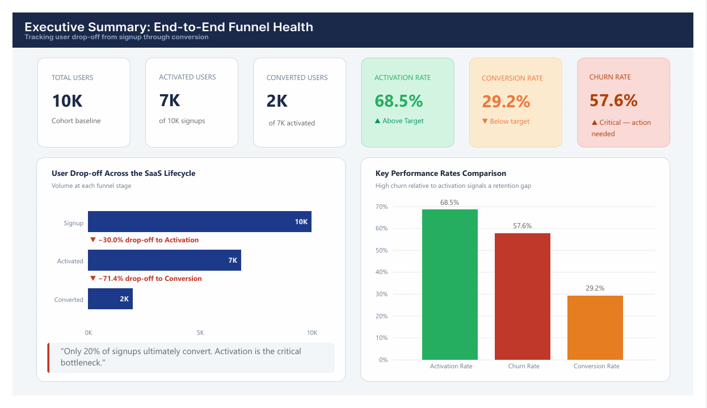
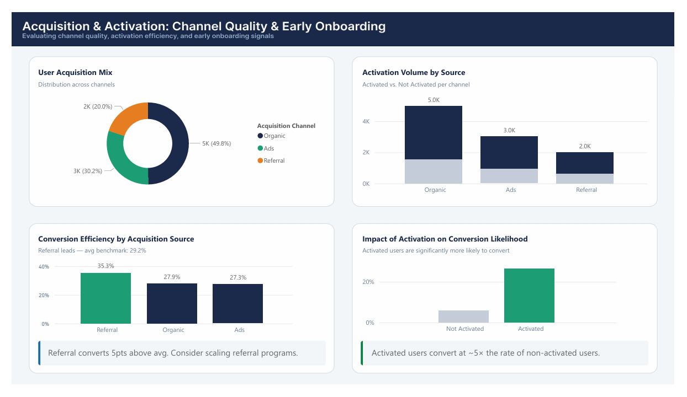
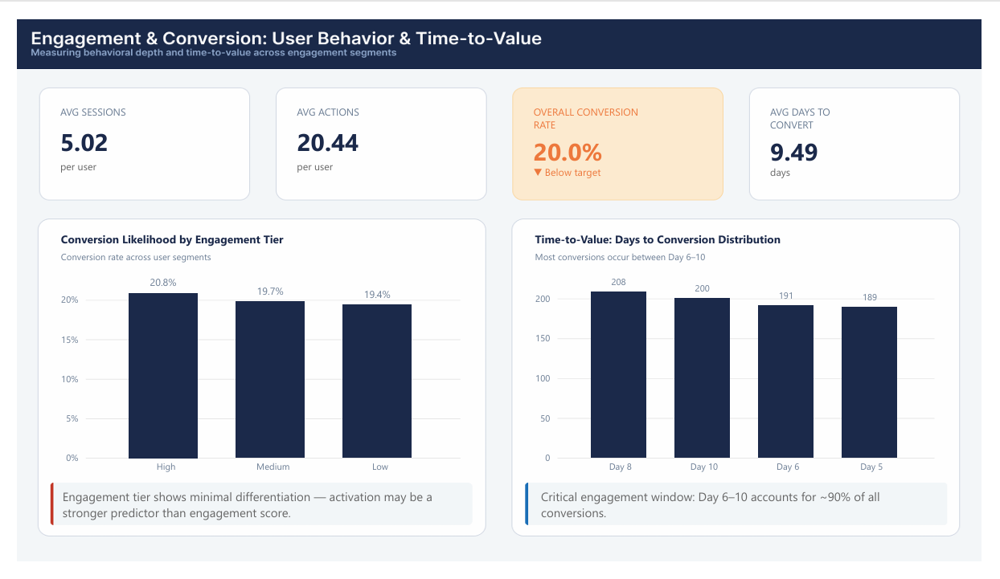
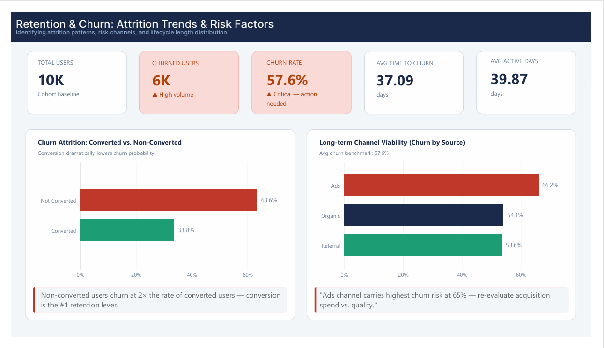

# NexaFlow SaaS Funnel Analytics

**End-to-end funnel intelligence for a SaaS product** — mapping user behavior across the Signup → Activation → Conversion → Retention → Churn lifecycle through SQL-driven analysis and a multi-page Power BI dashboard.

---

## Project Overview

NexaFlow SaaS Funnel Analytics is a product analytics project that investigates why only 20% of users who sign up for a SaaS platform ultimately convert to paying customers. Using a 10,000-user behavioral dataset, this project applies structured SQL analysis and interactive Power BI dashboards to identify the precise friction points in the user lifecycle, segment conversion quality by acquisition channel, and surface actionable strategies for improving monetization and retention.

The analysis follows the complete user journey — from first signup through activation, conversion, and eventual churn — producing a decision-ready intelligence layer for product and growth teams.

---

## Problem Statement

A SaaS platform is experiencing a critical gap between user acquisition and revenue generation. Despite strong top-of-funnel volume, fewer than 1 in 5 signups converts to a paid plan. Churn sits at a platform-wide rate of 57.6%, and there is limited visibility into which acquisition channels, behavioral segments, and lifecycle stages are driving these inefficiencies.

The core questions driving this analysis:

- Where in the funnel does user momentum break down — and by how much?
- Which acquisition channels yield high-quality, conversion-ready users versus low-intent churn risk?
- Is there a behavioral or temporal threshold that predicts whether a user will convert?
- How does conversion status influence long-term retention outcomes?

---

## Business Objective

> Identify the primary levers that drive conversion and retention, enabling product and growth teams to prioritize interventions that reduce churn, improve trial-to-paid yield, and reallocate acquisition spend toward high-ROI channels.

---

## Dataset Information

| Attribute | Details |
|---|---|
| Source | Synthetic dataset (portfolio project) |
| File | `clean_saas_funnel.csv` |
| Total Records | 10,000 users |
| Coverage | Full lifecycle: Signup → Activation → Conversion → Churn |

**Key columns include:**

- `is_activated`, `is_converted`, `is_churned` — lifecycle stage flags
- `acquisition_channel` — Organic, Ads, Referral
- `sessions_count`, `actions_count` — behavioral engagement metrics
- `days_to_convert`, `time_to_churn` — velocity and attrition timing
- `cohort_month` — monthly acquisition cohort
- `plan_type`, `revenue` — monetization tier and revenue value

---

## Tech Stack

| Layer | Tools |
|---|---|
| Data Preparation | Python, Pandas |
| Exploratory Analysis | Python, Matplotlib, Seaborn |
| Analytical Querying | MySQL |
| Dashboarding | Power BI Desktop (DAX, Power Query) |
| Version Control | Git, GitHub |

---

## Project Workflow

```
Raw Dataset (CSV)
     │
     ▼
Data Cleaning & Validation (Python / Pandas)
     │
     ▼
Exploratory Data Analysis (Python)
     │
     ▼
SQL Analysis — 12 Analytical Queries + Reporting View (MySQL)
     │
     ▼
Power BI Dashboard — 4 Pages (DAX Measures + Power Query)
     │
     ▼
Business Insights & Strategic Recommendations
```

---

## Data Cleaning & Preparation

Before analysis, the dataset was validated and standardized in Python:

- Verified row counts and column completeness; confirmed no critical null values in lifecycle flag columns
- Validated binary encoding consistency for `is_activated`, `is_converted`, `is_churned`
- Confirmed `days_to_convert` and `time_to_churn` were non-null only for users in the relevant lifecycle states
- Standardized `cohort_month` formatting for consistent temporal grouping in SQL and Power BI
- Verified `revenue` values were present exclusively for converted users

The cleaned output was exported as `clean_saas_funnel.csv` and loaded into MySQL for query-layer analysis.

---

## Exploratory Data Analysis

The Python EDA phase examined distributions, correlations, and segment-level patterns to form the analytical hypotheses tested in SQL.

**Key focus areas:**

- Distribution of users across lifecycle stages to establish funnel volume baselines
- Sessions and actions distributions by conversion status to assess behavioral predictors
- Churn timing distribution to identify early-exit patterns
- Acquisition channel composition and its initial relationship to downstream outcomes
- Cohort-level variation in conversion rates to detect seasonal or product-driven trends

The EDA confirmed that raw session counts showed weak predictive correlation with conversion — a finding that directly shaped the SQL segmentation and recommendation strategy.

---

## SQL Analysis

The SQL layer (`saas_funnel_segment_analysis.sql`) contains 12 analytical queries structured progressively from macro-level funnel metrics down to individual segment profiling. A final reporting view was created for Power BI integration.

### Query Index

| # | Query | Business Purpose |
|---|---|---|
| 1 | Basic Validation & Funnel Overview | Establish total user counts across lifecycle stages |
| 2 | Aggregate Funnel Analysis | Compute overall activation, conversion, and churn rates |
| 3 | Stage-wise Drop-off Analysis | Isolate Signup→Activation and Activation→Conversion loss volumes |
| 4 | Activation → Conversion Impact | Test whether activation milestone meaningfully drives paid conversion |
| 5 | Channel Performance Segmentation | Rank channels by conversion yield and churn risk |
| 6 | Engagement Tier Segmentation | Segment users by session frequency to find behavioral thresholds |
| 7 | Time-to-Convert Velocity | Measure the average and range of days from signup to conversion |
| 8 | Churn Timing Buckets | Categorize churned users by early, mid, and late-stage exit timing |
| 9 | Converted vs. Non-Converted Churn | Contrast retention behavior across monetization states |
| 10 | Monthly Cohort Conversion Trends | Track conversion rates by acquisition cohort to detect temporal shifts |
| 11 | Monetization Yield by Plan Tier | Quantify revenue contribution and average deal size by subscription plan |
| 12 | High-Value User Profiling | Correlate engagement depth with channel origin to profile ideal customers |

**Reporting Layer:** A `funnel_summary` SQL view aggregates conversion and churn metrics by `acquisition_channel` and `cohort_month`, serving as the optimized data source for Power BI drill-down analysis.

---

## Dashboard

The Power BI dashboard (`NexaFlow_SaaS_Funnel_Analytics.pbix`) comprises four purpose-built pages, each targeting a distinct analytical lens.

### Page 1 — Executive Summary: End-to-End Funnel Health

Provides a board-level snapshot of the platform's full lifecycle performance with headline KPI cards and staged volume visualization.

**Visuals:** Funnel bar chart (Signup → Activated → Converted), KPI rate comparison bar chart
**KPIs:** Total Users, Activated Users, Converted Users, Activation Rate, Conversion Rate, Churn Rate

---

### Page 2 — Acquisition & Activation: Channel Quality & Early Onboarding

Evaluates the quality of each traffic source beyond raw volume — ranking channels by downstream conversion yield and activation efficiency.

**Visuals:** Acquisition mix donut chart, Activation Volume by Source stacked bar, Conversion Efficiency by Channel bar chart, Activation Impact comparison chart
**Key Finding Callout:** Referral converts 5 points above platform average; activated users convert at ~5× the rate of non-activated users.

---

### Page 3 — Engagement & Conversion: User Behavior & Time-to-Value

Examines behavioral depth and conversion timing to determine whether session volume or temporal windows are stronger predictors of paid conversion.

**Visuals:** Conversion Likelihood by Engagement Tier bar chart, Time-to-Value Days Distribution chart
**KPIs:** Avg Sessions per User, Avg Actions per User, Overall Conversion Rate, Avg Days to Convert

---

### Page 4 — Retention & Churn: Attrition Trends & Risk Factors

Surfaces churn risk by conversion status and acquisition channel, providing the retention layer of the funnel intelligence.

**Visuals:** Converted vs. Non-Converted Churn bar chart, Long-term Channel Viability (Churn by Source) chart
**KPIs:** Total Users, Churned Users, Churn Rate, Avg Time to Churn, Avg Active Days

---

## Key Insights

**1. Activation is the Primary Monetization Bottleneck**
A 71.4% drop-off occurs between the activation and conversion stages — the steepest single loss point in the funnel. While 68.5% of signups reach activation, only 29.2% of those activated users proceed to a paid plan. Users are completing initial setup but not realizing sufficient product value to commit financially.

**2. Misaligned Acquisition Spend is Driving Artificial Churn**
The paid Ads channel — accounting for 30.2% of total signups — exhibits the highest churn rate at 66.2%, well above the 57.6% platform average. This signals a fundamental mismatch between ad targeting and product-market fit, making current Customer Acquisition Cost deployment highly inefficient.

**3. The Critical Day 6-10 Conversion Window**
Approximately 90% of all successful conversions occur within a five-day window spanning Days 6 through 10, with an average time-to-convert of 9.49 days. Users who remain on the free tier beyond Day 11 show a statistically dominant probability of churning, exposing a gap in late-trial intervention strategies.

**4. Session Volume Functions as a Vanity Metric**
Engagement tier segmentation reveals minimal differentiation in conversion rates across Low (19.4%), Medium (19.7%), and High (20.8%) session segments. Raw login frequency does not reliably predict paid conversion — feature adoption depth and milestone completion are stronger signals of genuine user health.

**5. Conversion is the Single Most Powerful Retention Lever**
Non-converted users churn at 63.6% versus 33.8% for converted users — nearly twice the rate. Converting a user to a paid plan is not simply a revenue event; it is the platform's primary mechanism for securing long-term retention.

**6. Referral Delivers Superior Conversion Quality**
The Referral channel converts at 35.3%, outperforming the platform average by 6 full percentage points, while also posting a lower-than-average churn rate of 53.6%. Despite representing only 20% of acquisition volume, Referral demonstrates the highest return on customer acquisition investment.

---

## Business Recommendations

**1. Reallocate Customer Acquisition Budget Toward High-Yield Channels**
Audit and deprecate the bottom-performing paid ad campaigns. Redirect this budget into scaling the Referral program and expanding high-intent Organic/SEO initiatives. The Ads channel's 66.2% churn rate indicates a structural quality problem that budget scaling will worsen, not resolve.

**2. Optimize Day 1–5 Time-to-Value**
Restructure the initial onboarding flow to aggressively guide new signups toward completing activation milestones. Integrate UI elements — progress bars, contextual checklists, and guided product tours — to minimize cognitive load and accelerate the user's core value discovery within their first five days.

**3. Deploy Automated Day 6–10 Lifecycle Interventions**
Engineer targeted, trigger-based campaigns that activate specifically on Day 6 to capture users in the peak conversion window. This should include time-sensitive in-app notifications, behavioral email sequences, and strategic limited-time upgrade offers designed to convert users before momentum fades.

**4. Transition to Milestone-Based Product Analytics**
Pivot internal telemetry away from session count monitoring toward milestone completion tracking. Update SQL logic and dashboards to measure engagement based on the execution of high-value platform workflows, enabling proactive identification of stalled users before they reach churn.

---

## KPIs & Metrics

| KPI | Value |
|---|---|
| Total Users (Cohort Baseline) | 10,000 |
| Activated Users | 7,000 (68.5%) |
| Converted Users | 2,000 (29.2% of activated / 20% of total) |
| Churned Users | ~6,000 (57.6%) |
| Avg Days to Convert | 9.49 days |
| Avg Time to Churn | 37.09 days |
| Avg Active Days | 39.87 days |
| Referral Conversion Rate | 35.3% |
| Organic Conversion Rate | 27.9% |
| Ads Conversion Rate | 27.3% |
| Ads Churn Rate | 66.2% |
| Converted User Churn Rate | 33.8% |
| Non-Converted User Churn Rate | 63.6% |
| Signup → Activation Drop-off | −30.0% |
| Activation → Conversion Drop-off | −71.4% |

---

## Folder Structure

```
nexaflow-saas-funnel-analytics/
│
├── 01_data/
│   ├── raw/
│   │   └── saas_funnel_raw.csv
│   │
│   └── processed/
│       └── clean_saas_funnel.csv
│
├── 02_python_analysis/
│   ├── data_cleaning.ipynb
│   └── exploratory_analysis.ipynb
│
├── 03_sql/
│   ├── saas_funnel_segment_analysis.sql
│   └── funnel_reporting_views.sql
│
├── 04_dashboard/
│   ├── NexaFlow_SaaS_Funnel_Analytics.pbix
│   └── dashboard_screenshots/
│       ├── executive_overview.png
│       ├── acquisition_activation.png
│       ├── engagement_conversion.png
│       └── retention_churn.png
│
├── 05_reports/
│   ├── funnel_insights.md
│   └── strategic_recommendations.md
│
├── 06_docs/
│   └── metric_definitions.md
│
├── README.md
├── requirements.txt
└── .gitignore
```

---

## Screenshots

### Page 1 — Executive Summary: End-to-End Funnel Health


KPI cards, staged funnel bar chart, and key performance rate comparisons. Reveals that only 20% of total signups ultimately convert, with activation identified as the critical bottleneck.

---

### Page 2 — Acquisition & Activation: Channel Quality & Early Onboarding


Acquisition mix donut, activation volume by source, conversion efficiency by channel, and the activation impact comparison. Highlights Referral as the top-performing channel and demonstrates the ~5× conversion lift from activation.

---

### Page 3 — Engagement & Conversion: User Behavior & Time-to-Value


Engagement tier conversion comparison and days-to-conversion distribution. Shows minimal differentiation across session tiers and surfaces the Day 6–10 window as the critical conversion period.

---

### Page 4 — Retention & Churn: Attrition Trends & Risk Factors


Converted vs. non-converted churn comparison and channel-level churn viability chart. Demonstrates that conversion nearly halves churn probability and that the Ads channel is a structural retention liability.


---

## Challenges & Solutions

**Challenge: Distinguishing Meaningful Engagement from Surface Activity**
The initial hypothesis assumed that higher session counts would correlate with stronger conversion likelihood. SQL segmentation revealed that conversion rates across Low, Medium, and High engagement tiers were nearly identical (19.4%, 19.7%, 20.8%), invalidating session count as a predictive KPI.

*Solution:* Reframed the analysis around activation status and milestone completion as the primary behavioral predictors, and included a recommendation to transition internal tracking toward feature-depth metrics.

**Challenge: Isolating Channel Quality from Volume Effects**
With Organic accounting for nearly 50% of acquisitions, raw channel comparisons risked being distorted by volume. Normalizing all comparisons to conversion rate and churn rate percentages — rather than absolute counts — produced a channel quality picture independent of acquisition scale.

**Challenge: Communicating the Conversion Window Precisely**
Quantifying the Day 6–10 conversion window required distributing `days_to_convert` values for all converted users and validating that approximately 90% of conversions fell within this band. This analysis informed both the SQL velocity query and the Time-to-Value dashboard visual.

---

## Future Improvements

- **Predictive Churn Model:** Build a binary classification model (Logistic Regression or XGBoost) using behavioral and channel features to score users by churn probability in real time.
- **A/B Test Simulation Layer:** Model the projected revenue impact of the Day 6–10 intervention strategy against a control baseline, quantifying the financial upside of the recommendation.
- **Feature Adoption Depth Metrics:** Expand the dataset to include specific workflow completion flags (e.g., "completed core feature X"), enabling milestone-based segmentation to replace session-count analysis.
- **LTV Modeling by Channel:** Extend the revenue analysis query to calculate full Customer Lifetime Value by acquisition source, providing a more complete ROI picture for acquisition spend decisions.
- **Automated Reporting Pipeline:** Schedule the SQL reporting view to refresh on a weekly cadence and connect directly to Power BI Service for live dashboard monitoring.

---

## How to Run the Project Locally

**Prerequisites:** Python 3.8+, MySQL 8.0+, Power BI Desktop

```bash
# 1. Clone the repository
git clone https://github.com/your-username/nexaflow-saas-funnel-analytics.git
cd nexaflow-saas-funnel-analytics

# 2. Install Python dependencies
pip install pandas matplotlib seaborn jupyter

# 3. Launch the EDA notebook
jupyter notebook notebooks/funnel_eda.ipynb
```

```sql
-- 4. Load the dataset into MySQL
CREATE DATABASE nexaflow;
USE nexaflow;

-- Import clean_saas_funnel.csv via MySQL Workbench Table Data Import Wizard
-- Then run the analysis queries:
SOURCE sql/saas_funnel_segment_analysis.sql;
```

**5. Open the Power BI dashboard:**
Open `dashboard/NexaFlow_SaaS_Funnel_Analytics.pbix` in Power BI Desktop. If prompted, update the data source path to point to your local `clean_saas_funnel.csv` file.

---

## Conclusion

NexaFlow SaaS Funnel Analytics demonstrates that a 57.6% churn rate and a 20% signup-to-conversion yield are not symptoms of a weak product — they are symptoms of misaligned acquisition targeting, an under-optimized activation flow, and a missed intervention window between Days 6 and 10. The analysis produces a clear, evidence-backed priority list: fix the activation-to-conversion drop-off first, make conversion the explicit goal of every post-signup touchpoint, and redirect acquisition investment toward channels that deliver genuinely conversion-ready users.

This project reflects a full analytics workflow — from raw data through SQL segmentation to executive dashboard — and frames every technical finding in the context of a specific business decision.

---

## Author

**Naveen**
Aspiring Data Analyst | Python · SQL · Power BI

- GitHub: [github.com/your-username](https://github.com/your-username)
- LinkedIn: [linkedin.com/in/your-profile](https://linkedin.com/in/your-profile)

---

*Built as part of a data analytics portfolio. Dataset is synthetic and generated for portfolio purposes.*
